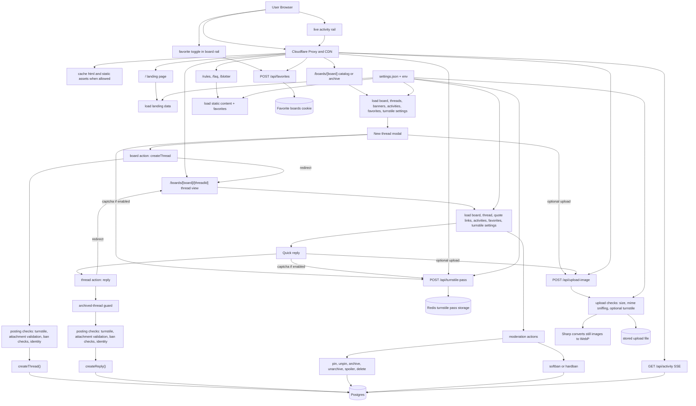

# whisperwall

Whisperwall is a compact anonymous imageboard built with SvelteKit, Postgres, Drizzle, and Redis.

## Stack

- SvelteKit
- Postgres + Drizzle ORM
- Redis
- Sharp for server-side image conversion

## App Flow



## Local Setup

```bash
cp .env.example .env
docker compose up -d
bun install
bun run db:push
bun run dev
```

Open `http://127.0.0.1:5173`.

## Notes

- Still images are normalized on the server to WebP.
- Threads, posts, boards, and activity are stored in Postgres.
- Favorites are cookie-backed.
