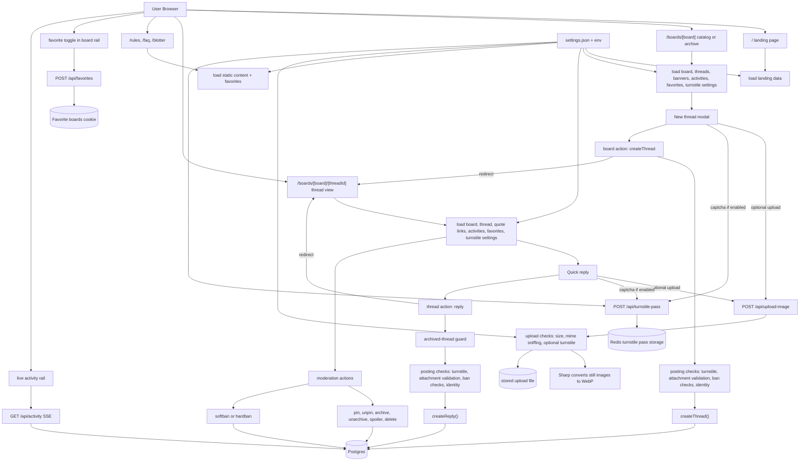

# whisperwall

Whisperwall is a compact anonymous imageboard built with SvelteKit, Postgres, Drizzle, and Redis.

## Stack

- SvelteKit
- Postgres + Drizzle ORM
- Redis
- Sharp for server-side image conversion

## App Flow



### Reading The Diagram

- `settings.json` and env values drive board definitions, banners, and whether Turnstile is enabled.
- Post creation and reply creation both go through the same safety layers: captcha pass, attachment parsing, and moderation checks before writing to Postgres.
- Image uploads are handled separately through `/api/upload-image`, where still images are normalized to WebP and files are stored before the post action submits.
- Favorites are lightweight and cookie-backed, while live activity updates stream from `/api/activity`.
- Archived threads can still be viewed, but replies are blocked by both the UI and the server action guard.

## Local Setup

```bash
cp .env.example .env
docker compose up -d
bun install
bun run db:push
bun run dev
```

Open `http://127.0.0.1:5173`.

## Notes

- Still images are normalized on the server to WebP.
- Threads, posts, boards, and activity are stored in Postgres.
- Favorites are cookie-backed.
